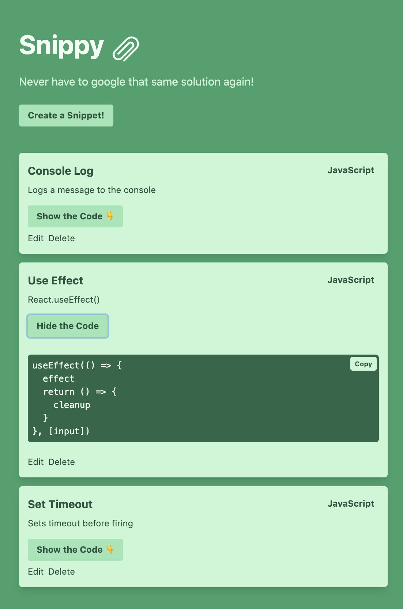
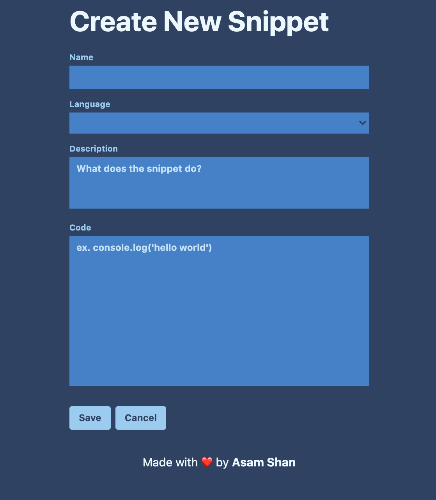

# Snippy

A CRUD application for storing code snippets built with [NextJS](https://nextjs.org/) and styled with [TailwindCSS](https://tailwindcss.com/). Forms are handled by the amazing [React Hook Form](https://react-hook-form.com/). Database used is [FaunaDB](https://fauna.com/).

## Why

I am sick of having to google the same things over and over again. I have snippets saved in my notes app, my google keep folders and pinned in various channels across Slack and Discord, which is just annoying having to try remember what lives where and searching them all out.

Having a simple application I can open in the browser with all my snippets will save me lots of time.

## Features

Right now the feature list is pretty small, just the simple CRUD operations are available:

- Grab all snippets from the DB
- Create a new snippet
- Update an existing Snippet
- Delete an existing Snippet

## What's Next

**NOW DONE**
<del>There are many things I would like to add to this application. First of all I will be adding a filter for snippets by language, so the user can easily toggle all snippets by language (Javascript for example).</del>

**NOW DONE**
<del>Expanding on that the next logical step would be a simple search box to query the snippets by name.</del>

Finally I would like to make this useful for anybody who wants to use it, so adding authentication, so creating and updating snippets are locked behind a private route allowing anyone to search the snippets without being able to spam me with lots of bogus snippets :).

## Screenshots

